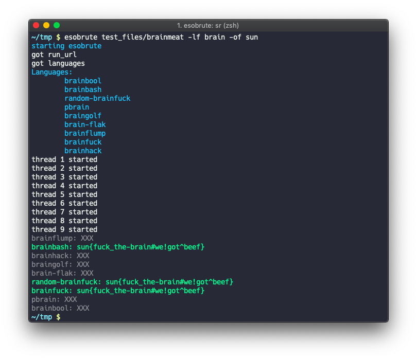

# esobrute

An esoteric programming languages brute forcer powered by tio.run. Only support python2 currently.

## Install

`pip install esobrute`

or:

`git clone https://github.com/tcode2k16/esobrute.git`

## Usage

```
~ $ esobrute --help
Usage: esobrute [OPTIONS] FILE

Options:
  -t, --thread INTEGER       Number of threads
  -p, --plain
  -ls, --list-lang
  -l, --lang TEXT            Selected language
  -lf, --lang-filter TEXT    filter languages
  -of, --output-filter TEXT  filter output
  --help                     Show this message and exit.
```

## Example

Example solving the "Brainmeat" challenge from Sunshine CTF 2019:


